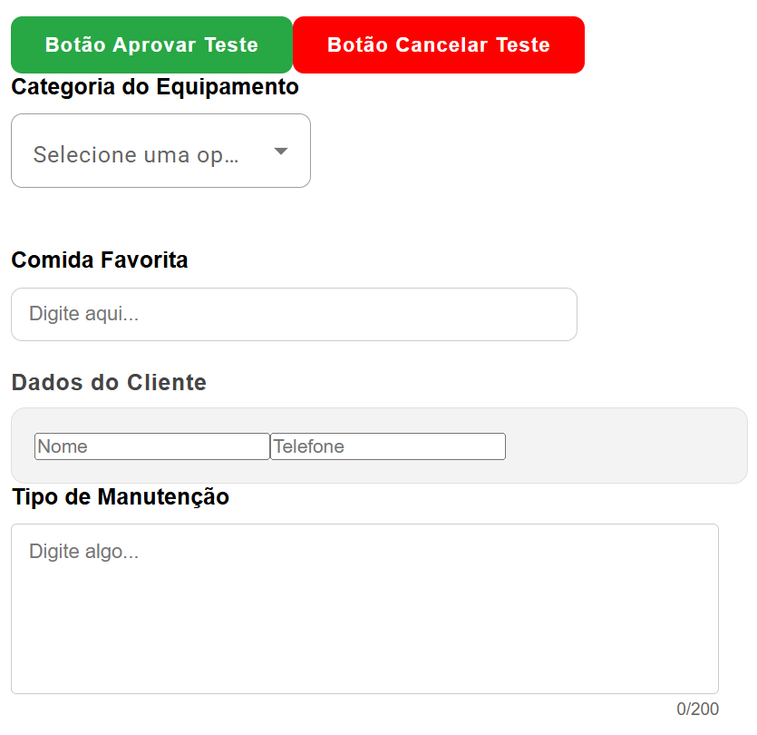

## 📘 Guia de Componentes 

Este guia contém a documentação técnica para implementação dos componentes customizados do projeto.

---
* ⚠️ Recomendação: Para manter consistência visual e responsividade,
envolva todos os componentes com `app-card-visualizacao`, quando necessário.

### 1. Componente: Combo (Dropdown)
**Onde importar no .ts:** `import { ComboComponent, OpcaoCombo } from './shared/combo/combo.component';`

**Exemplo de configuração no .ts:**
```typescript
minhaLista: OpcaoCombo[] = [
  { value: 'rep', viewValue: 'Reparo' },
  { value: 'inst', viewValue: 'Instalação' }
];

aoMudarValor(valor: string | number) {
  console.log('Valor selecionado:', valor);
}
```
**Como usar no arquivo html**
```html
<app-combo altura="52px" largura="100%"
  titulo="Tipo de Manutenção"
  [lista]="minhaLista"
  (mudou)="aoMudarValor($event)">
</app-combo>
```

### 2. Componente: Input
**Onde importar no .ts:** `import { InputComponent } from './shared/input/input.component';`

**Exemplo de configuração no .ts: Criar variável**
```typescript
valorDigitado: string = 'Sushi';
```

**Como usar no arquivo html**
```html
<app-input altura="52px" largura="100%"
  titulo="Comida Favorita"
  placeholder="Digite aqui..."
  [valor]="valorDigitado"
  (mudou)="valorDigitado = $event">
</app-input>
```

### 3. Componente: Input-card
**Onde importar no .ts:** 
`import { InputCardComponent } from './shared/input-card/input-card.component';`
`import { FormsModule } from '@angular/forms';`

* Você deve importar o FormsModule, obrigatoriamente! Dessa forma, o ngModel funcionará corretamente. 

**Exemplo de configuração no .ts: Exemplo:**
```typescript
nomeCliente: string = '';
telCliente: string = '';
descricao: string = '';
```

**Como usar no arquivo html**

* Dados do cliente
```html
<app-input-card label="Nome" largura="50%" altura="100px">
  <div class="minha-customizacao-input">
  <input type="text" [(ngModel)]="nomeCliente" placeholder="Nome" />
  <input type="text" [(ngModel)]="telCliente" placeholder="Telefone" />
  </div>
</app-input-card>
```

* Descrição
```html
<app-input-card label="Descrição" largura="50%" altura="100px">
  <div class="minha-customizacao-textArea">
  <textarea [(ngModel)]="descricao" placeholder="Digite uma descrição..."></textarea>
  </div>
</app-input-card>
```
### Você deve estilizar o input interno no seu css!
### Dica 1: Envolva o input/textArea em uma div.
### Dica 2: A largura e altura que você pode alterar é referente ao bloco cinza. Se quiser que o input/textArea acompanhe, altere no arquivo css.
* Exemplo:
```css

/* Estiliza o input dentro do card */
.minha-customizacao-input input {
  width: 100%;
  height: 45px;
  padding: 0 15px;
  margin-bottom: 10px;
  border: 1px solid #ccc;
  border-radius: 6px;
  background: white;
  font-family: sans-serif;
  outline: none;
}

/* Estiliza a textarea dentro do card */
.minha-customizacao-textArea textarea {
  width: 100%;
  min-height: 100px;
  height: 100px;
  border: 1px solid #ccc;
  border-radius: 4px;
  resize: vertical; 
}
```

### 4. Componente: Botão Aprovar
**Onde importar no .ts:** 
`import { BotaoAprovarComponent } from './shared/botao-aprovar/botao-aprovar.component';`

**Exemplo de configuração no .ts: Exemplo: Criar a função**
```typescript
aprovar() {
  console.log('Aprovado!');
}
```

**Como usar no arquivo html**
```html
<app-botao-aprovar (clicou)="aprovar()">
  Aprovar Solicitação
</app-botao-aprovar>
```

### 5. Componente: Botão Cancelar
**Onde importar no .ts:** 
`import { BotaoCancelarComponent } from './shared/botao-cancelar/botao-cancelar.component';`

**Exemplo de configuração no .ts: Exemplo: Criar a função**
```typescript
cancelar() {
  console.log('Cancelado!');
}
```

**Como usar no arquivo html**
```html
<app-botao-cancelar 
  [confirmacao]="true"
  (clicou)="cancelar()">
  Cancelar Solicitação
</app-botao-cancelar>
```

### 6. Componente: Text-area
**Onde importar no .ts:** 
`import { TextAreaComponent } from './shared/text-area/text-area.component';`

**Exemplo de configuração no .ts: Exemplo: Criar a variável**
```typescript
observacao: string = '';
```

**Como usar no arquivo html**
```html
<app-text-area altura="250px" largura="100%"
  titulo="Observações"
  placeholder="Digite algo..."
  [valor]="observacao"
  (mudou)="observacao = $event">
</app-text-area>
```
### Você deve ajustar a altura e a largura do componente, conforme a necessidade da sua tela!

### 7. Componente: Card-visualizacao
**Onde importar no .ts:** 
`import { CardVisualizacaoComponent } from './shared/card-visualizacao/card-visualizacao.component';`

**Como usar no arquivo html**
```html
<app-card-visualizacao>
  CONTEÚDO DO SEU HTML
</app-card-visualizacao>
```

## Componentes


---
## 💡 Dicas e Boas Práticas
A responsividade é com você 😉 Não se esqueça!
* Para campos na mesma linha, use largura="50%"
* Envolva os componentes em uma div
* Evite usar px fixos para a largura, prefira %
* Prefira criar o seu layout usando GRID/FLEX no css

## 🎉 Regras de Ouro para Responsividade
Todos os componentes possuem "travas" internas para evitar que o layout quebre em notebooks:
* **Max-Width:** Todos os componentes têm `max-width: 100%` por padrão. Mesmo que você defina `largura="2000px"`, ele não passará do limite da tela.
* **Box-Sizing:** O cálculo de largura já inclui bordas e padding.
* **Min-Width:** Os campos possuem uma largura mínima de `250px` para garantir que o texto permaneça legível em telas menores.

## 🔆 Exemplo de como deixar dois componentes lado a lado de forma alinhada:
**HTML:**
```html
<div class="linha-form">
  <app-combo largura="50%" titulo="Categoria" ...></app-combo>
  <app-input largura="50%" titulo="Modelo" ...></app-input>
</div>
```
```css
.linha-form {
  display: flex;
  gap: 20px; 
  align-items: flex-end; 
  width: 100%;
}
```

## ✅ Dicas para os componentes
*  Sempre importar o componente antes de usar
*  Criar variáveis no .ts quando necessário
*  Usar (evento)="funcao()" para capturar ações
*  Usar [propriedade]="variavel" para enviar dados
---